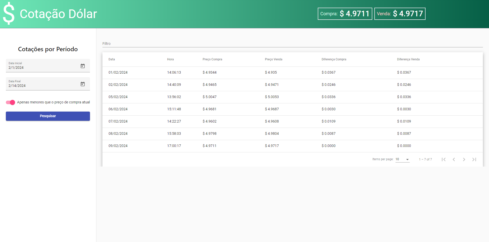

# FRONT-END SHX Admission Test

### The project's focus is to obtain information about the current dollar exchange rate.

## Screenshot


## Dependencies
- Node 12.14.1
- Angular 12.2.x
- VSCode Extension: Angular Language Service 12.2.x !IMPORTANT

## How to Install
```bash
npm install
```

## How to Run
```bash
npm run start
```

## How to contribute

If you want to add anything to any of my Open Source projects, please follow the Conventional Commits standard:

###  --> https://www.conventionalcommits.org/en/v1.0.0/

Example:

```typescript
<type>[optional scope]: <description>

[optional body]

[optional footer(s)]
```
